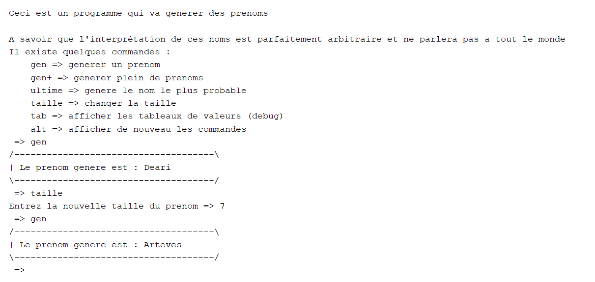

# NameGen

## Project presentation

I realized this project for fun and entertainement. The app offers some features, for example generating namge with your own set of data or generating your own database of generated names in a .txt file lit there is in [here](./ressources/nameLists/). 
The algorithm uses a probability calculation that a letter arrives after another and chooses one at random weighted by the probability that it arrives.

## Add your files

- [ ] [Find the GitHub repository here](https://github.com/Hubrec/nameGen) you can get all the code here, the repository is public so you can clone the project at your convenience.

## Try it now

You can try the generator downloading the source code.

## Visuals

 - Here is an example of the names you can generate and the functions you can use :

    

## Usage

This app aims to have fun trying to create new names and understand better how the database influence the generation.

## Authors

**Mathis Guerin**

- [ ] [My GitHub](https://github.com/Hubrec)
- [ ] [My Linkedin](https://www.linkedin.com/in/mathis-guerin-43b228222/)

## License

This project is under a MIT liscence described in the [LICENSE](./LICENSE) on the project. 

## Project status

The development of the project is closed for the moment but dosen't run perfectly, there are still some bugs that needs to be fixed.
